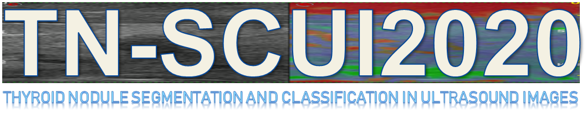
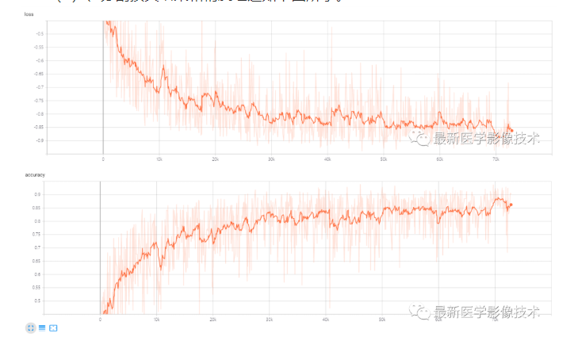
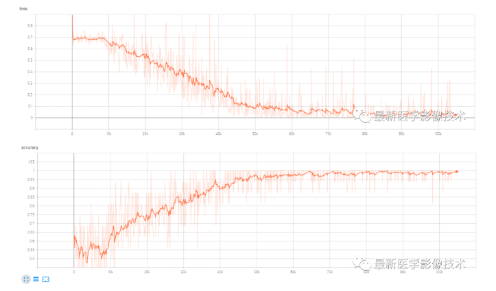
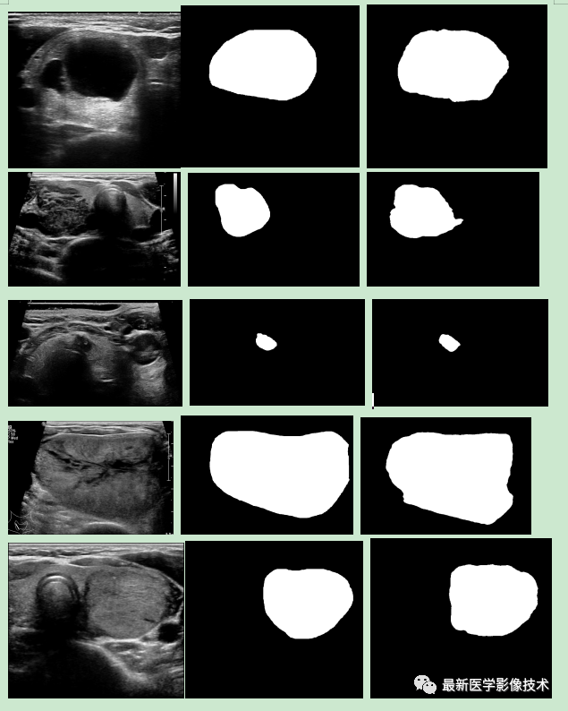

# TN-SCUI2020-Challenge
> This is an example of the Us imaging is used to segment and classify thyroid nodule.

## Prerequisities
The following dependencies are needed:
- numpy >= 1.11.1
- SimpleITK >=1.0.1
- tensorflow-gpu ==1.14.0
- pandas >=0.20.1
- scikit-learn >= 0.17.1

## How to Use
* coming soon

## Result

* segment train loss and train accuracy

* classify train loss and train accuracy

* test dataset segmentation result：left is source image,median is ground truth mask,right is predict mask

* more detail can follow my WeChat Public article.

## Contact
* https://github.com/junqiangchen
* email: 1207173174@qq.com
* Contact: junqiangChen
* WeChat Number: 1207173174
* WeChat Public number: 最新医学影像技术
